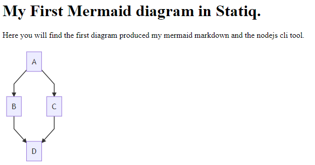

# Using Mermaid diagrams with Statiq

| | |
| - | - |
| Article Status | Released |
| Article Version | 1.0 |
| First Written | 2021-03-27 |
| Last Revision | 2021-03-27 |
| License | MIT |

  <strong>TLDR:</strong> The sample repository is available at: <a href="https://github.com/dpvreony/article-statiq-mermaid">https://github.com/dpvreony/article-statiq-mermaid</a>.

## Introduction

Mermaid is a toolset for producing diagrams using markdown notation. Statiq is a .NET based static website generation toolset. This article details a way to integrate the pair to display diagrams inside a statically generated website.

## Getting started

1. Create a .NET Core 3.1 (or NET5) console app project and add Statiq as a dependency

<pre>
<code>
dotnet add package Statiq.Web
</code>
</pre>

2. Update the Program Entry point to utilize Statiq

<pre>
<code>
using System.Threading.Tasks;
using Statiq.App;
using Statiq.Web;

namespace StatiqMermaid.Website
{
    public static class Program
    {
        public static async Task<int> Main(string[] args)
        {
            return await Bootstrapper
                .Factory
                .CreateWeb(args)
                .RunAsync();
        }
    }
}
</code>
</pre>

3. Mermaid has a NodeJS Command Line Interface tool which can be installed as an development dependency. You will need a recent version of NodeJS installed then you can install the CLI:

<pre>
<code>
npm install @mermaid-js/mermaid-cli -D
</code>
</pre>

You're now ready to get running with Mermaid

## Preparing a Mermaid Markdown file

  This sample makes use of the flowchart example from the Mermaid website, where you can find more samples and instructions on the markdown notation.

1. create a folder structure in your console app project of <strong>"input\img\mermaid"</strong>
2. Add a text file to the mermaid folder with an .mmd file extension. For example flowchart.mmd
3. Add the following markdown notation to the file:

<pre>
<code>
graph TD;
    A-->B;
    A-->C;
    B-->D;
    C-->D;
</code>
</pre>

## Transforming the Mermaid diagram to an image

  You may want to consider changing your .gitignore to include the following lines:

src/StatiqMermaid.Website/input/img/mermaid/*.svg 
src/StatiqMermaid.Website/input/img/mermaid/*.png 
src/StatiqMermaid.Website/output

1. In the folder containing your solution create a batch file along the lines of build-mermaid.cmd
2. Add the following commands:

<pre>
<code>
pushd StatiqMermaid.Website\input\img\mermaid
..\..\..\node_modules\.bin\mmdc -i flowchart.mmd -o flowchart.svg
popd
</code>
</pre>

## Building Statiq and Viewing the result

  The following script can sometimes error in Kestrel with the message "An attempt was made to access a socket in a way forbidden" if the port it is trying to use has been reserved by the operating system. Try changing the port number.
  For more detailed information check out https://ardalis.com/attempt-made-to-access-socket/

1. In the folder containing your solution create a batch file along the lines of run-testserver.cmd
2. Add the following command

<pre>
<code>
dotnet run --project StatiqMermaid.Website -- preview --port 30080
</code>
</pre>

## Going further

Now you have the basic flow you can consider:

1. Playing with more diagrams and different image output styles and file formats.
2. Using a foreach loop in a batch file or powershell script to transfrom multiple markdown files.
3. Using a shellexecute stage during your Statiq Console app build phase
4. Setting up a CI\CD flow to automate the build and deploy.

## References

<ul>
<li>Github mermaid-cli https://github.com/mermaid-js/mermaid-cli</li>
<li>Mermaid Flowchart Sameple https://mermaid-js.github.io/mermaid/#/flowchart?id=flowcharts-basic-syntax</li>
</ul>

